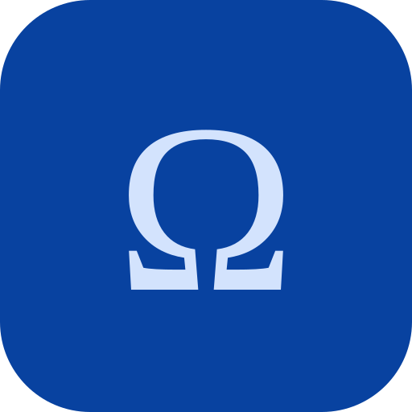
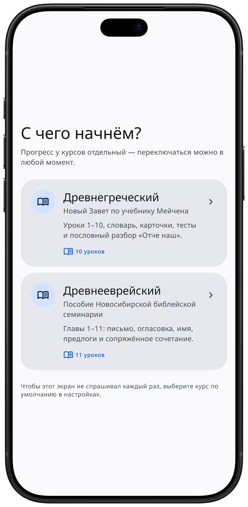
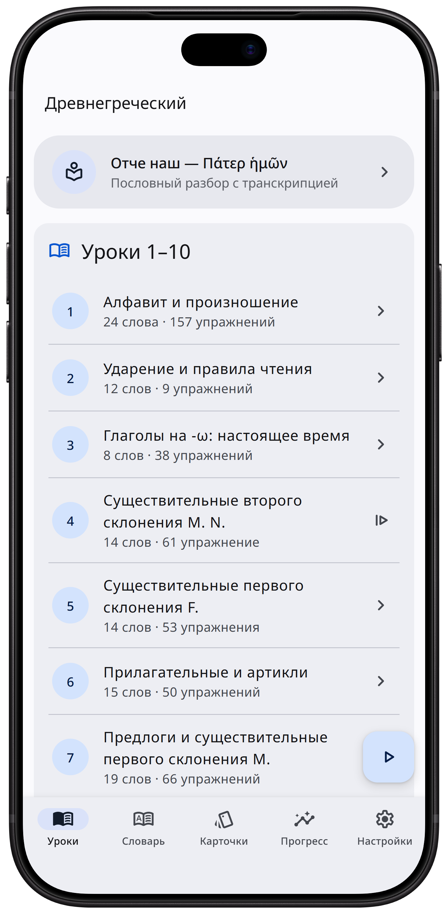
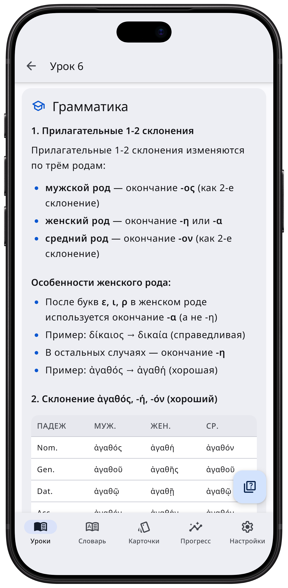
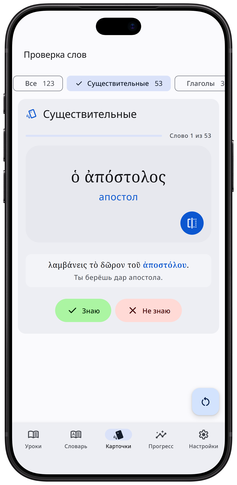
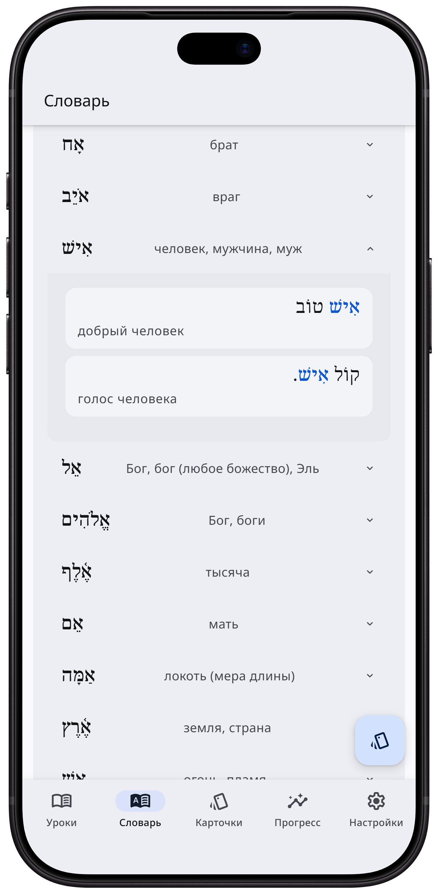

<p align="center">
  
</p>

<h1 align="center">Anticus</h1>

<p align="center">
  Изучение древнегреческого и древнееврейского по учебникам для библеистов —
  прямо в браузере, офлайн, без установки.
</p>

<p align="center">
    <a href="https://grandiozova.github.io/anticus/"><picture><source media="(prefers-color-scheme: dark)" srcset="https://shieldcn.dev/badge/%D0%9E%D1%82%D0%BA%D1%80%D1%8B%D1%82%D1%8C%20%D0%BF%D1%80%D0%B8%D0%BB%D0%BE%D0%B6%D0%B5%D0%BD%D0%B8%D0%B5-0842a0.svg?size=lg&amp;logo=lu%3ASparkles&amp;mode=dark"></picture></a>
</p>

## Скриншоты

<div align="center">
  
  
  
  
  
</div>

## Курсы

| Курс | Учебник | Объём |
|---|---|---|
| **Древнегреческий** | Дж. Грешем Мейчен, «Учебник греческого языка Нового Завета» | Уроки 1–10 |
| **Древнееврейский** | Пособие Новосибирской библейской богословской семинарии | Главы 1–11 |

Курс выбирается на старте и меняется в настройках; прогресс и карточки у каждого свои.
Греческий — политонически, с ударениями и придыханиями. Еврейский — справа налево,
с огласовкой; интерфейс при этом остаётся русским.

## Возможности

- Уроки: грамматика, словарь, упражнения
- Словарь с поиском, фильтром по частям речи и примерами
- Карточки для запоминания (весь словарь или отдельная часть речи)
- Тесты, отслеживание прогресса и работа над ошибками
- Светлая, тёмная, сепия или системная тема
- Работает офлайн, устанавливается на телефон как приложение

Греческий курс: падеж, число, согласование, артикль, перевод фраз и предложений,
разбор молитвы «Отче наш». Еврейский курс: огласовки, шва, дагеш, слогораздел,
род и число, сопряжённое сочетание, местоименные суффиксы, перевод фраз и предложений.

## Как пользоваться

Откройте [ссылку](https://grandiozova.github.io/greek_bot/) — установка не нужна,
прогресс сохраняется локально в браузере. После первого открытия приложение
работает офлайн; в мобильном браузере его можно добавить на домашний экран.

Для локального запуска — склонируйте репозиторий и откройте `index.html`:
сборка и сервер не нужны.

## Тесты

```bash
npm install
npm test
```

Тесты на jsdom поднимают `index.html`, проходят все упражнения во всех уроках
и проверяют экраны целиком. Подробности — в [tests/README.md](tests/README.md).

## Источники материалов

**Древнегреческий:** Дж. Грешем Мейчен. Учебник греческого языка Нового Завета /
Перевод А. А. Руденко; ред. Е. Б. Смагина. — М.: Российское Библейское общество,
2024. ISBN 978-5-85524-292-8. Оригинал: J. Gresham Machen. *New Testament Greek
for Beginners*, 1923. Права на русскоязычную версию — у Российского Библейского общества.

**Древнееврейский:** Учебное пособие по грамматике древнееврейского языка.
1-й год обучения. — Новосибирская библейская богословская семинария, 2011.
В основе: Gary D. Pratico, Miles V. Van Pelt. *Basics of Biblical Hebrew Grammar*.
Права — у правообладателей пособия.

## Авторские права

Проект некоммерческий и образовательный.

© 2026 Александра Морозова, Марк Ингрэм. Код **не** распространяется по открытой
лицензии — опубликован для ознакомления, любое использование требует письменного
разрешения (см. [LICENSE](LICENSE)). Права на учебные материалы — у правообладателей,
указанных выше. Сторонние компоненты (шрифты, иконки, дизайн-система) — по своим
лицензиям, полный список на экране настроек.
